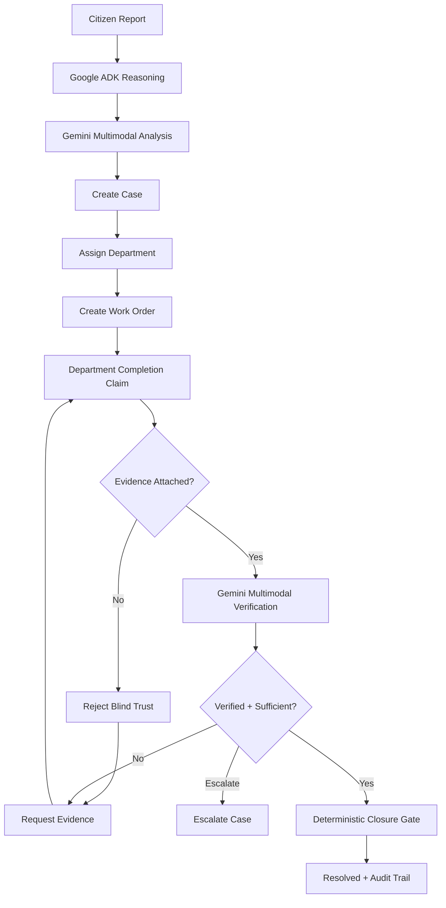
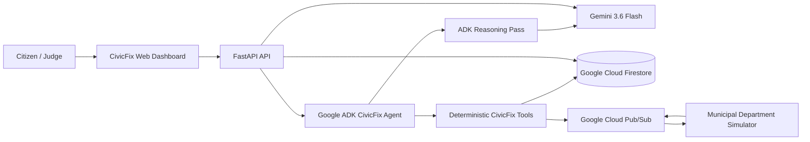

# CivicFix — Autonomous Community Resolution Engine

[](https://civicfix-c13b.onrender.com/)
[](https://github.com/peterkehinde673/civicfix)
[](https://ai.google.dev/)
[](https://google.github.io/adk-docs/)
[](https://fastapi.tiangolo.com/)

> **CivicFix turns an unstructured citizen complaint into a routed municipal work order, rejects unsupported completion claims, and independently verifies resolution evidence before closure.**

## Live Demo

**Application:** https://civicfix-c13b.onrender.com/

CivicFix is a hackathon demonstration. Municipal departments and field crews are simulated; the AI reasoning, evidence verification, audit trail, and safety gates are implemented in the application.

## Problem

Traditional complaint systems often stop at ticket creation. CivicFix focuses on what happens after the ticket is created:

1. Citizen reports are unstructured and difficult to route.
2. Departments can claim that work is complete without sufficient proof.
3. A ticket can be marked resolved without independently checking the physical result.
4. Citizens and operators need an auditable lifecycle rather than a black-box status change.

## Solution

CivicFix is an autonomous community-resolution workflow that:

- **Understands** citizen reports with Gemini 3.6 Flash, including optional images.
- **Plans** the likely category, priority, department and remediation actions.
- **Acts** through deterministic CivicFix tools that create cases, assignments and work orders.
- **Rejects blind trust** when a department claims completion without evidence.
- **Verifies multimodally** by comparing the original problem, department claim, evidence description and post-repair image with Gemini.
- **Fails safely** when verification is unavailable or insufficient.
- **Audits** important lifecycle transitions in Firestore.
- **Publishes events** through Google Cloud Pub/Sub for asynchronous workflow integration.

## Why It Is Agentic

CivicFix is not only a chatbot or a form. The system combines a Google ADK agent with Gemini reasoning and deterministic tools. The ADK agent performs an autonomous reasoning pass on intake, while state-changing operations remain behind explicit tools and a deterministic closure gate.

The architecture deliberately separates **AI reasoning** from **state-changing actions** so an AI/API failure cannot silently close a case.

## Core Agent Loop

```text
REPORT
  ↓
UNDERSTAND
  ↓
PLAN
  ↓
ACT / DISPATCH
  ↓
WAIT FOR DEPARTMENT CLAIM
  ↓
VERIFY EVIDENCE
  ↓
RECOVER / REQUEST EVIDENCE
  ↓
ESCALATE WHEN NECESSARY
  ↓
RESOLVE ONLY AFTER VERIFIED PROOF
```

### Autonomous lifecycle



## Architecture



### Safety boundary

The important closure path is:

```text
Resolution evidence
      ↓
Gemini verification
      ↓
VerificationResult
      ↓
record_verification_tool
      ↓
close_case_tool
      ↓
RESOLVED only when verified=True,
SUFFICIENT evidence, and RESOLVE_CASE
```

A Gemini/API failure produces an unverified result and cannot be converted into a successful closure.

## Multimodal Gemini

CivicFix uses the Google GenAI SDK and `Part.from_bytes()` for image inputs. Images can be attached during initial intake and during independent resolution verification.

For resolution verification, Gemini receives:

- the original problem;
- the department's completion claim;
- the evidence description; and
- the post-repair evidence image when available.

The verification result contains:

- `verified`;
- `confidence_score`;
- `reason`;
- `evidence_quality`; and
- `action` (`RESOLVE_CASE`, `REQUEST_EVIDENCE`, or `ESCALATE_CASE`).

## Verification Safety

CivicFix follows one hard rule:

> **NO VERIFIED EVIDENCE = NO CASE CLOSURE.**

The final `close_case_tool` is a deterministic safety gate. Even if another part of the application requests closure, it requires a successful verification result with sufficient evidence and the `RESOLVE_CASE` decision.

If Gemini verification fails, CivicFix returns an insufficient/unverified result and requests evidence instead of assuming success.

## Five Demo Scenarios

The built-in autonomous demonstration supports:

1. **Streetlight** — broken streetlight near a school.
2. **Drainage** — blocked storm drainage and flooding.
3. **Roads / Pothole** — severe road crater affecting traffic.
4. **Waste** — overflowing waste accumulation.
5. **Water Leak** — high-pressure municipal water-main burst.

The municipal department responses are simulated so judges can reproduce the full lifecycle quickly.

## Google Technologies

### Gemini 3.6 Flash

Used for multimodal report understanding, categorization, prioritization, recommended actions, visual observations and independent resolution verification.

### Google Agent Development Kit (ADK)

Used for the CivicFix root agent and its real Runner execution path. The ADK agent performs the autonomous reasoning pass while deterministic tools enforce state-changing actions and closure safety.

### Google Cloud Firestore

Used for persistent case state, evidence records and audit entries.

### Google Cloud Pub/Sub

Used for workflow event publication and asynchronous municipal integration points.

### Cloud Run readiness

The repository includes a Cloud Run-compatible Dockerfile with dynamic `$PORT` handling. A Google Cloud deployment should be configured for the final hackathon demonstration before submission if the selected submission video requires live Cloud Run proof.

## Project Structure

```text
civicfix/
├── app/
│   ├── agents/
│   │   ├── adk_agent.py
│   │   ├── civicfix_agent.py
│   │   └── tools.py
│   ├── api/
│   ├── frontend/
│   ├── models/
│   ├── services/
│   │   ├── gemini.py
│   │   ├── firestore.py
│   │   ├── pubsub.py
│   │   └── departments.py
│   ├── config.py
│   └── main.py
├── docs/
│   ├── architecture/
│   ├── screenshots/
│   ├── DEMO_SCRIPT.md
│   └── JUDGE_GUIDE.md
├── tests/
├── Dockerfile
├── requirements.txt
├── .env.example
└── README.md
```

## Quick Start

### Requirements

- Python 3.11+
- Google Gemini API key
- Google Cloud project if using Firestore/Pub/Sub

### Install

```bash
git clone https://github.com/peterkehinde673/civicfix.git
cd civicfix
python -m venv .venv
source .venv/bin/activate
pip install -r requirements.txt
```

### Environment

Copy the example configuration:

```bash
cp .env.example .env
```

Set the required values in `.env`. Never commit real credentials.

### Run locally

```bash
uvicorn app.main:app --host 0.0.0.0 --port 8000
```

Then open `http://localhost:8000`.

## Environment Variables

See `.env.example` for the complete configuration. The important values include the Gemini API key/model and Google Cloud project configuration used by the application.

Do not put API keys, service-account JSON files or private credentials in Git.

## API Overview

The FastAPI application exposes health, case and orchestration endpoints used by the dashboard. The exact routes should be treated as the source of truth in `app/api/` and the OpenAPI schema available from the running FastAPI application.

When running locally, FastAPI documentation is available at:

```text
http://localhost:8000/docs
```

## Testing

Run the test suite with:

```bash
pytest -q
```

The test suite covers health/API behavior, evidence requirements, verification safety and the autonomous demo scenarios.

## Docker

Build the container:

```bash
docker build -t civicfix .
```

Run it:

```bash
docker run --rm -p 8000:8000 --env-file .env civicfix
```

The container uses the platform-provided `$PORT` variable, making it suitable for Cloud Run-style execution.

## Cloud Run Deployment

The Dockerfile is prepared for Cloud Run. A typical deployment sequence is:

```bash
gcloud auth login
gcloud config set project YOUR_PROJECT_ID
gcloud services enable run.googleapis.com artifactregistry.googleapis.com cloudbuild.googleapis.com firestore.googleapis.com pubsub.googleapis.com
gcloud builds submit --tag REGION-docker.pkg.dev/YOUR_PROJECT_ID/civicfix/civicfix:latest
gcloud run deploy civicfix --image REGION-docker.pkg.dev/YOUR_PROJECT_ID/civicfix/civicfix:latest --region REGION --allow-unauthenticated
```

Configure the Gemini API key and required Google Cloud environment variables using Cloud Run environment-variable or secret configuration. Do not place secrets in the image or repository.

## Render Deployment

The current public demonstration is hosted on Render:

https://civicfix-c13b.onrender.com/

Render remains useful for the public web demo, while Cloud Run can be used for the Google Cloud deployment required for the final judging demonstration.

## Screenshots

Screenshots used for the project are stored under `docs/screenshots/`. Recommended judging views include:

- dashboard;
- report intake;
- Gemini analysis;
- autonomous workflow;
- blind-trust rejection;
- multimodal verification; and
- final audit trail.

Only screenshots that actually exist in the repository should be referenced in the final submission.

## Judge Guide

For a quick evaluation:

1. Open the live demo.
2. Select one of the five scenarios.
3. Run the autonomous demonstration.
4. Watch the citizen issue get analyzed and routed.
5. Watch the department's unsupported completion claim get rejected.
6. Watch CivicFix request evidence.
7. Watch the submitted resolution evidence pass through Gemini verification.
8. Watch the deterministic closure gate resolve the case.
9. Inspect the case/audit history.

The key judging question is not whether CivicFix can create a ticket. It is whether an agent can move a real-world-style incident through reasoning, action, evidence verification and safe closure.

## Demo Script

See `docs/DEMO_SCRIPT.md` for the short demonstration narrative and `docs/JUDGE_GUIDE.md` for the judge flow.

The final video should show the actual running application and, when required by the hackathon rules, the backend running on Google Cloud.

## Limitations

- Municipal departments are simulated for the hackathon.
- Field repair actions are simulated.
- Image storage is designed for hackathon demonstration and may use Base64 representations.
- AI verification is probabilistic, so deterministic safety gates remain in control of final closure.
- Cloud Run, Firestore and Pub/Sub require appropriate Google Cloud configuration and credentials.

## Future Roadmap

- Real municipal department integrations.
- Citizen notifications and two-way communication.
- Geospatial clustering and duplicate-incident detection.
- SLA prediction and escalation analytics.
- Stronger evidence provenance and media storage.
- Production-grade authentication and role-based access control.
- Persistent ADK session/state infrastructure for larger deployments.

## Hackathon

Built for the **All Things Agentic Hackathon**.

CivicFix focuses on autonomous task execution with a critical safety property: an agent may coordinate the resolution lifecycle, but it cannot close a case merely because a department says the work is finished.

## License

See the repository for the project's current license and contribution information.
